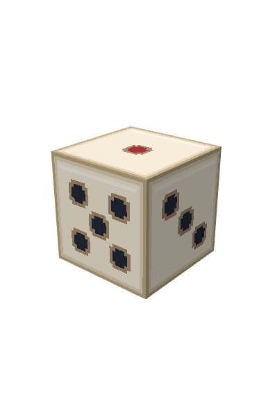

# 카지노 소품 에셋

Blockbench에서 편집할 수 있는 정적 `.bbmodel` 원본 두 개입니다. 텍스처는 PNG 데이터로 파일 안에 포함되어 있으며, 외부 이미지 경로가 필요하지 않습니다.

| 에셋 | 리소스 ID | 크기 (16 단위 = 1블록, 배율 1 기준) | 구성 |
| --- | --- | --- | --- |
| 주사위 | `semion-td:prop/casino_die` | 8 × 8 × 8, 한 변 0.5블록 | 큐브 1개, 그룹 1개, 96 × 64 텍스처 |
| 블랙잭 테이블 | `semion-td:prop/blackjack_table` | 48 × 24.5 × 32, 약 3 × 1.53 × 2블록 | 큐브 60개, 그룹 7개, 256 × 256 텍스처 |

크기는 가로 × 높이 × 깊이 순서입니다. 원점은 바닥 중앙이며, 실제 충돌 영역은 게임 코드에서 따로 지정해야 합니다.

## 미리보기

실제 Blockbench 뷰포트에서 캡처했습니다.




## 편집

Blockbench의 **File → Open Model**에서 다음 파일을 엽니다.

- `src/main/resources/model/semion-td/prop/casino_die.bbmodel`
- `src/main/resources/model/semion-td/prop/blackjack_table.bbmodel`

주사위는 상단 1 / 하단 6, 북쪽 2 / 남쪽 5, 동쪽 3 / 서쪽 4로 배치했습니다. 아이보리 바탕, 검은 눈, 빨간 1눈을 사용합니다.

테이블은 녹색 펠트, 어두운 목재, 패딩 레일, 황동 장식, 카드와 칩 스택을 포함합니다. `frame`, `felt`, `rail`, `legs`, `dealer`, `chips`, `cards` 그룹으로 나누었습니다. 카드와 칩은 현재 장식용입니다. 회전하는 기계식 턴테이블이 아닌 카지노 게임 테이블입니다.

두 모델 모두 Generic Model / 파일 포맷 4.5이며, 저장된 애니메이션은 없습니다. `BIL 1.7.0+1.21.6`의 기존 모델 경로 규칙에 맞췄습니다. 게임 카탈로그나 엔티티에는 아직 연결하지 않았으므로 게임 내 자동 생성, 상호작용, 주사위 굴림, 카드 배분 기능은 포함하지 않습니다.

## 검증

```powershell
python .agents/skills/semiontd-blockbench-import-library/scripts/inspect_bbmodel.py src/main/resources/model/semion-td/prop/casino_die.bbmodel --model-id semion-td:prop/casino_die
python .agents/skills/semiontd-blockbench-import-library/scripts/inspect_bbmodel.py src/main/resources/model/semion-td/prop/blackjack_table.bbmodel --model-id semion-td:prop/blackjack_table
```

두 파일의 BIL 정적 검사와 Blockbench 불러오기/텍스처 표시를 확인했습니다. 실제 서버의 BIL holder 생성, warmup, Polymer 팩 생성 및 클라이언트 표시 검증은 게임 엔티티에 연결할 때 수행해야 합니다. 연결 후 모델을 수정하면 서버를 재시작하고 리소스팩을 다시 받아야 합니다.

2026-09-06에 `./gradlew.bat test runGameTest remapJar --console=plain --no-daemon`을 실행했으나, `repo.biryeong.kim`의 HTTP 521 응답으로 BIL 등 의존성을 가져오지 못해 프로젝트 설정 단계에서 실패했습니다. 테스트와 JAR 패키징은 완료되지 않았습니다.

## 생산 타워 적용

주사위 3개 단계별 여섯 방향 모델과 슬롯머신 3개 단계 모델, 포커 테이블 적용 정보는 [개편 문서](gamble-poker-and-support-tiers.ko.md)를 참고하세요.
