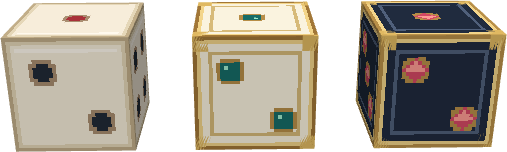
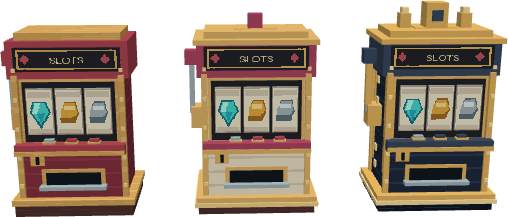
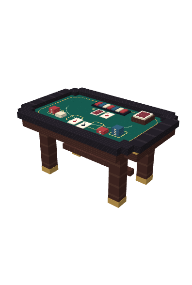

# 겜블 빌더

겜블 빌더는 라운드 지원 시설, 도박꾼의 영구 강화, 한 번의 카드 베팅으로 성장하는 포커 테이블을 사용하는 창작 빌더입니다. 직업 ID는 `semion-td:gamble_towers`입니다. 아래 값은 소스 기본값이며 운영 서버의 기존 설정을 자동으로 덮어쓰지 않습니다.

## 시작 타워

| 타워 | 설치비 | 최대 체력 | 공격/지원 범위 | 역할 |
| --- | ---: | ---: | ---: | --- |
| 주사위 타워 I | 45 | 10 | 지원 3.5 | 범위 안 내 전투 타워 지원, 두 주사위 도박 해금 |
| 도박꾼 타워 | 60 | 110 | 공격 6.5 | 일반·마법 혼합 평타, 반복 도박 성장 |
| 슬롯머신 타워 I | 45 | 10 | 지원 3.5 | 가장 강한 도박꾼 한 기 지원, 슬롯 도박 해금 |
| 포커 테이블 | 50 | 200 | 평타 없음 | 1회 베팅으로 체력 강화, 전투 사망 시 범위 피해 |

주사위·슬롯머신 타워의 T1/T2/T3 체력은 10/100/300입니다. 지원 타워와 포커 테이블은 공격하지 않으며 사거리·공격력 지원을 받아도 평타가 생기지 않습니다.

지원 시설은 라운드 시작마다 1~6을 추첨해 그 라운드 효과와 머리 위 숫자를 표시합니다. 지원 범위와 연결선은 파티클로 표시합니다. 전투 중 파괴되면 해당 시설의 효과·연결선을 회수하고, 라운드 종료·플레이어 탈락 시 남은 겜블 지원 효과를 정리합니다. 초당 체력 감소는 체력 1에서 멈춥니다.

## 주사위 타워

주사위 타워는 범위 안에 있는 같은 소유자의 전투 타워를 모두 지원합니다. 지원 타워 자신과 다른 지원 타워는 대상이 아닙니다. 여러 주사위 타워가 같은 대상을 지원하면 출처별 효과가 함께 적용됩니다.

| 눈 | 결과 |
|---:|---|
| 1 | 무작위 약화 능력치 1개, 기본 약화량의 2배 |
| 2 | 무작위 약화 능력치 1개, 기본 약화량 |
| 3 | 무작위 강화 능력치 1개, 기본 강화량 |
| 4 | 무작위 강화 능력치 1개, 기본 강화량의 1.5배 |
| 5 | 서로 다른 무작위 강화 능력치 2개, 각각 기본 강화량의 1.75배 |
| 6 | 서로 다른 무작위 강화 능력치 2개, 각각 기본 강화량의 2.25배 |

무작위 능력치는 사거리, 초당 체력 회복·감소, 공격력, 최대 체력 네 종류입니다.

| 능력치 | 기본 강화량 | 기본 약화량 |
|---|---:|---:|
| 사거리 | +0.25칸 | -0.25칸 |
| 초당 체력 회복·감소 | 초당 +2.5 회복 | 초당 -1 감소 |
| 공격력 | +2.5 | -2.5 |
| 최대 체력 | +25 | -25 |

모든 티어가 `1~6`을 같은 확률로 굴립니다. 지원 효과의 긍정 수치는 T1/T2/T3에서 각각 `1배/2배/3.5배`가 됩니다. 약화 수치는 티어에 따라 커지지 않습니다. 지원 범위는 `3.5 → 5 → 6.5칸`, 강화 비용은 `100 → 200다이아`입니다.

## 슬롯머신 타워

슬롯머신은 범위 안의 도박꾼 중 누적 도박 점수가 가장 높은 한 기와 연결됩니다. 같은 도박꾼에는 슬롯머신이 최대 3기까지 연결되며, 자리가 가득 차면 다음으로 점수가 높은 도박꾼을 선택합니다. 점수가 같으면 가까운 도박꾼을 우선합니다.

| 눈 | 결과 |
|---:|---|
| 1 | 서로 다른 무작위 약화 능력치 2개, 각각 기본 약화량의 2배 |
| 2 | 서로 다른 무작위 약화 능력치 2개, 각각 기본 약화량 |
| 3 | 서로 다른 무작위 강화 능력치 2개, 각각 기본 강화량 |
| 4 | 서로 다른 무작위 강화 능력치 2개, 각각 기본 강화량의 1.5배 |
| 5 | 네 강화 능력치 전부, 각각 기본 강화량의 1.75배 |
| 6 | 네 강화 능력치 전부, 각각 기본 강화량의 2.25배와 티어별 다이아 보상 |

모든 티어가 `1~6`을 같은 확률로 굴립니다. 긍정 수치와 연결 범위, 강화 비용은 주사위 타워와 같이 `1배/2배/3.5배`, `3.5/5/6.5칸`, `100/200다이아`로 증가합니다. 눈 6이 나오면 T1/T2/T3에서 각각 `5/15/35다이아`를 즉시 얻습니다.

## 도박꾼: 비용과 해금

| 도박꾼 업그레이드 | 비용 | 조건 | 명목 평균 점수/다이아 |
| --- | ---: | --- | ---: |
| 홀수 / 짝수 | 85 | 기본 해금 | 0.176471 |
| 주사위 두 개 | 170 | 같은 플레이어의 살아 있는 주사위 타워 | 0.228758 |
| 슬롯 도박 | 260 | 같은 플레이어의 살아 있는 슬롯머신 타워 | 0.213675 |

주사위와 슬롯머신은 같은 라인 안에 있으면 단계·거리와 무관하게 해금합니다. 다른 플레이어의 시설은 인정하지 않습니다. 사망하거나 판매하면 해당 도박이 다시 잠깁니다. 홀짝은 계속 이용할 수 있습니다. 조건은 UI와 실제 비용 차감 전에 모두 확인합니다.

슬롯의 평균 보상은 55.555556점입니다. 두 주사위 대비 명목 점수 효율은 **93.4066%**입니다. 이 비율은 명목 점수 기준이며 보험·능력치 하한·전직 효과까지 동일한 전투 가치를 뜻하지 않습니다. 보상표, 300점 최고 보상, 두 능력치 분할, 마지막 강화 초과 보상은 유지합니다.

## 도박꾼: 점수와 능력치

도박꾼의 기본 공격은 주 대상 주변 2.5칸 안의 적에게 주 대상 피해의 60%를 함께 줍니다. 이 공격 범위는 일반 도박으로 변하지 않고 최종 전직으로만 넓어집니다. 주사위 눈에 따라 최대 체력·일반 공격력·마법 공격력·사거리 중 무작위 능력치가 오르거나 내려갑니다. 내부 점수 1당 변화량은 다음과 같습니다.

| 선택된 능력치 | 점수 1점당 변화 |
|---|---:|
| 최대 체력 | 5 HP |
| 일반 공격력 | 0.50 피해 |
| 마법 공격력 | 0.50 피해 |
| 사거리 | 0.05블록 |

홀수·짝수 맞히기에 성공하면 `+350 HP`, `+35 일반 공격력`, `+35 마법 공격력`, `+3.5 사거리` 중 하나를 얻습니다. 실패하면 `-200 HP`, `-20 일반 공격력`, `-20 마법 공격력`, `-2 사거리` 중 하나가 적용됩니다. 손실 보험 보유 시 실패 수치는 `-160 HP`, `-16 일반 공격력`, `-16 마법 공격력`, `-1.6 사거리`로 완화됩니다.

주사위 두 개의 합 2부터 12까지 결과 점수는 `-70, -50, -30, -10, +20, +40, +50, +60, +90, +120, +150`입니다. 같은 눈이면 양수·음수 모두 2배가 됩니다. 가장 자주 나오는 합 7은 40점으로 `+200 HP`, `+20 일반 공격력`, `+20 마법 공격력`, `+2 사거리` 중 하나를 줍니다. 합이 10 이상이면 전체 보상을 서로 다른 무작위 능력치 두 개가 절반씩 나눠 받습니다. 예를 들어 6과 6은 총 300점을 150점씩 나눠 `+750 HP`, `+75 일반 공격력`, `+75 마법 공격력`, `+7.5 사거리` 중 서로 다른 두 가지를 얻습니다. 누적 도박 점수에는 나누기 전 전체 점수를 한 번만 반영합니다.

홀수·짝수 맞히기, 주사위 두 개 굴리기, 슬롯머신에서 좋은 결과가 나오면 25% 확률로 능력치 대신 `손실 보험`을 얻습니다. 복합 보상 구간에서도 능력이 뽑히면 손실 보험 하나만 얻습니다. 손실 보험은 이후 홀짝·두 주사위 도박에서 실패로 줄어드는 능력치 감소량을 20% 완화합니다. 이미 손실 보험을 보유한 뒤에는 좋은 결과가 다시 능력으로 바뀌지 않고 일반 능력치 보상을 줍니다.

누적 도박 점수는 최대 `+500`이며, 도박 결과로 이 값에 도달하면 네 도박 업그레이드가 모두 닫혀 더 이상 비용을 지불할 수 없습니다. 최대 체력·일반 공격력·마법 공격력·사거리의 양수 누적 변화도 각 능력치마다 500점 환산값을 넘지 않으므로, 실패와 성공을 반복해 표시 점수 상한을 우회할 수 없습니다. 음수 변화는 각 기본 능력치의 20% 하한을 유지합니다.

마지막 결과는 남은 누적 점수에 맞춰 잘라내지 않습니다. 예를 들어 499점에서 300점을 얻으면 표시 점수는 500에서 멈추지만 보상은 300점 전체로 계산하며, 능력치별 기존 한도는 적용합니다.

### 슬롯 보상

| 심볼 | 2개 일치 | 3개 일치 |
| --- | ---: | ---: |
| 철 조각 | 60점 | 150점 |
| 철 | 70점 | 180점 |
| 구리 | 80점 | 210점 |
| 금괴 | 90점 | 240점 |
| 에메랄드 | 100점 | 270점 |
| 다이아몬드 | 110점 | 300점 |

전부 다르면 25점입니다. 세 칸의 총 216가지 결과 중 전부 다른 결과는 120개(55.56%), 정확히 두 개 일치는 90개(41.67%), 세 개 일치는 6개(2.78%)입니다. 세 개 일치 보상은 서로 다른 능력치 두 개가 절반씩 나눠 받습니다. 최대 300점 / 능력치당 150점으로 기존 주사위 최고 보상과 같은 범위입니다.

일반·마법 공격력은 독립 추첨 대상이며 같은 확률과 `damagePerScore` 환산값(기본 0.5)을 사용합니다. 혼합 평타와 스플래시는 각각 `PHYSICAL` / `MAGIC` 피해 경로로 처리해 방어력·마법 저항력과 피해 통계를 구분합니다. 일반 성분으로 처치한 대상에는 마법 성분을 중복 적용하지 않습니다. 전직 전후 기본 공격력은 아래 표처럼 각각 절반씩 나누며, 상세창에서 구성과 증감량을 확인할 수 있습니다.

## 도박왕 전직

도박 직후 누적 점수가 `+400` 이상이면 `도박왕`, `-200` 이하이면 `어둠의 도박왕`으로 즉시 전직합니다. 전직은 기본 도박꾼에게 한 번만 일어나며 이후 점수가 반대쪽 기준을 넘어도 다른 전직으로 바뀌지 않습니다.

| 형태 | 전직 조건 | 기본 체력 | 기본 공격력 | 기본 사거리 | 공격 간격 | 범위 피해 반경 | 들고 있는 아이템 |
|---|---:|---:|---:|---:|---:|---:|---|
| 도박꾼 | 시작 | 110 | 일반 5 + 마법 5 | 6.5 | 13틱 | 2.5 | 금괴 |
| 도박왕 | 누적 점수 +400 이상 | 400 | 일반 20 + 마법 20 | 7.5 | 8틱 | 3.0 | 다이아몬드 |
| 어둠의 도박왕 | 누적 점수 -200 이하 | 440 | 일반 22 + 마법 22 | 8.0 | 8틱 | 3.25 | 네더라이트 주괴 |

전직 전까지 쌓인 최대 체력·일반 공격력·마법 공격력·사거리 고정 증감치, 누적 점수, 도박 횟수, 손실 보험과 최근 결과는 새 기본 능력치 위에 그대로 이어집니다. 두 최종 전직도 누적 점수 `+500`에 도달하기 전까지 홀·짝, 주사위 두 개, 슬롯머신 도박을 계속할 수 있습니다. 어둠의 도박왕은 도박왕보다 기본 체력과 공격력이 10% 높고 사거리와 범위 피해 반경도 소폭 높습니다.

## 포커 테이블

- 설치 비용 50, 기본 최대 체력 200. 평타와 추격이 없습니다. 사거리·공격력 지원을 받아도 평타가 생기지 않습니다.
- 타워 메뉴와 상세창에서 **200~1000 다이아 슬라이더**를 열고, 1다이아 단위로 한 번만 베팅합니다.
- 서버가 금액 범위·정수 여부·준비 단계·소유권·잔액·기존 베팅을 검사합니다. 이전 창의 토큰으로 판매 후 새로 설치한 타워에 베팅할 수 없습니다.
- 52장 중 중복 없이 3장을 뽑습니다. A23과 QKA는 스트레이트이며 KA2는 아닙니다.
- `강화 점수 = 베팅액 × 패 점수`, `최대 체력 = 기본 최대 체력 + 강화 점수 / 17`. 내부 체력은 소수로 유지하고 상세 표시는 반올림합니다.
- 플러시 이상이면서 강화 점수 **15,000 이상**이면 사망 디버프를 얻습니다. 미달하면 체력만 얻습니다.

| 결과 | 정확한 확률 | 패 점수 | 조건 충족 시 사망 디버프 |
| --- | ---: | ---: | --- |
| 8 하이 이하 | 8.1448% | 0 | 타워 영구 파괴 |
| 9 / 10 / J 하이 | 합계 22.2624% | 2 / 4 / 6 | 없음 |
| Q / K / A 하이 | 합계 43.9819% | 15 / 20 / 25 | 없음 |
| 원페어 | 16.9412% | 2 원페어 30점부터 A 원페어 42점 | 없음 |
| 플러시 | 4.9593% | 50 | 공격력 -20% |
| 스트레이트 | 3.2579% | 55 | 공격력·공격 속도 -20% |
| 트리플 | 0.2353% | 60 | 공격력·공격 속도·방어력 -20% |
| 스트레이트 플러시 | 0.2172% | 60 | 트리플과 동일 |

대실패에서는 `타워가 븅신같이 강화됐습니다`를 실제 시스템 메시지로 출력합니다. 베팅 손실은 논리 타워를 제거하므로 다음 라운드에 복구되지 않습니다. 베팅 비용은 판매 환불가에 포함하지 않습니다.

모든 포커 테이블은 **전투 사망 시 반경 2.5블록 적에게 미강화 상태에서는 최대 체력의 5%, 베팅 강화 후에는 10% 마법 피해**를 줍니다. 위 디버프도 같은 범위에서 **8초** 유지됩니다. 방어력 감소는 물리 방어력만 20% 줄이며 마법 저항력과 고정 피해에는 영향을 주지 않습니다. 여러 테이블의 동일 디버프는 더하지 않고 가장 강한 수치를 유지하며 지속시간을 갱신합니다. 판매·업그레이드 교체·베팅 실패에는 전투 사망 폭발이 발생하지 않습니다.

특수능력 최소 베팅은 플러시 300 / 스트레이트 273 / 트리플·스트레이트 플러시 250입니다. 포커의 명목 추가 HP 기여는 평균 1.216566 HP/다이아로, 너프된 두 주사위 점수를 전부 체력으로 환산한 1.143791보다 약 6.36% 높습니다. 파괴·평타 부재·디버프를 포함한 실제 전투 효율 비교는 별도입니다.

## 외형과 리소스

| 단계 | 주사위 / 슬롯머신 체력 | 주사위 | 슬롯머신 |
| --- | ---: | --- | --- |
| T1 | 10 | 기존 아이보리 | 크림슨 캐비닛 |
| T2 | 100 | 아이보리·금 장식·초록 눈금 | 아이보리·금 테두리·보석 장식 |
| T3 | 300 | 짙은 남색·금 장식·루비 눈금 | 짙은 남색·금 왕관·금 레버 |

구경꾼의 안정적인 ID `gamble_spectator_t1/t2/t3`는 유지하며 표시 이름을 슬롯머신 타워로 변경했습니다. 기존 집중 지원, 최대 3기 연결, 눈별 효과, 6 보상 다이아 5/15/35는 유지합니다. 슬롯 **타워의 지원 결과**와 도박꾼이 비용을 내는 **슬롯 도박**은 기존처럼 별도 판정입니다.





왼쪽부터 T1/T2/T3이며 Blockbench에서 직접 렌더링했습니다. 단계별 시각 배율은 0.75/0.90/1.05입니다.

- 주사위 T1: `semion-td:tower/gamble_dice_1..6`
- 주사위 T2/T3: `semion-td:tower/gamble_dice_t2_1..6`, `gamble_dice_t3_1..6`
- 슬롯머신: `semion-td:tower/gamble_slot_machine`, `gamble_slot_machine_t2`, `gamble_slot_machine_t3`
- 포커 테이블: 기존 `semion-td:prop/blackjack_table`, 배율 0.5

주사위는 각 단계마다 여섯 방향을 제공하고 서버 워밍업에 18개 모델을 모두 포함합니다. 라운드의 실제 눈금이 위를 향하고 단계 업그레이드에서도 눈금을 보존합니다. 정적 모델이며 별도 애니메이션은 없습니다. 모델 교체 후 BIL 캐시와 새 리소스팩을 반영하려면 서버 재시작이 필요합니다.



원본 `.bbmodel`은 `src/main/resources/model/semion-td/` 아래에서 Blockbench로 편집할 수 있습니다. PNG 텍스처를 내장한 Generic Model 포맷 4.5이며 BIL `1.7.0+1.21.6`을 사용합니다. `prop/casino_die.bbmodel`은 주사위 원본 소품이고, `prop/blackjack_table.bbmodel`은 프레임·펠트·레일·다리·카드·칩 그룹으로 구성한 테이블입니다. 카드와 칩은 장식용입니다. 테이블 원본 크기는 48 × 24.5 × 32 모델 단위이며 런타임 배율은 0.5입니다. 모델 크기가 실제 클릭·충돌 영역을 결정하지는 않습니다.

## 운영 설정과 검증

기존 `tower_balance.json`에 비용이 저장되어 있으면 도박꾼·도박왕·어둠의 도박왕 각각의 `bet_odd`, `bet_even`, `roll_two_dice`, `spin_slots` 비용을 85/85/170/260으로 맞춰야 합니다. 키 형식은 `gamble_gambler->bet_odd`입니다. 주사위·구경꾼 ID의 T2/T3 `maxHealth`도 100/300으로 맞춰야 합니다. 기존 도박꾼·도박왕·어둠의 도박왕의 `towers.<ID>.damage`는 5/20/22로 맞춰야 혼합 평타 기본값과 일치합니다. 새 `abilities.<ID>.baseMagicDamage`는 5/20/22로 추가됩니다. 포커의 `deathDamageRatio`는 0.05, `upgradedDeathDamageRatio`는 0.1입니다. 새 포커 기본값과 능력 키도 누락 기본값 병합으로 추가됩니다. 기존 운영 설정을 통째로 기본값으로 교체하지 않습니다.

회귀 테스트는 포커 22,100패 전수 계산, 슬롯 216가지 결과, 번들/코드 기본값 일치, 도박 해금·차감·환불, 마법 피해 분리, 라운드/설정 리로드, 사망 디버프·방어력 계산, 단계별 BIL 모델을 다룹니다.

```powershell
./gradlew.bat test runGameTest remapJar --console=plain --no-daemon
```

모델 수정 시 `.agents/skills/semiontd-blockbench-import-library/scripts/inspect_bbmodel.py`로 해당 `.bbmodel`을 검사하고 Blockbench에서 외형을 확인합니다. 실제 배포 전에는 생성된 리소스팩을 적용해 타워 클릭·충돌·라운드 눈금 표시를 확인해야 합니다. 테스트 실행 결과와 환경 제한은 해당 PR에 기록합니다.
