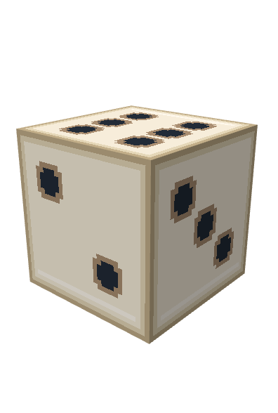

# 슬롯머신·복합 평타·주사위 모델

포커 테이블, 지원 건물 해금, 단계별 체력·외형은 [현재 개편 문서](gamble-poker-and-support-tiers.ko.md)에 정리했습니다.

## 적용 내용

도박꾼과 두 최종 전직에 `슬롯머신 돌리기`를 추가합니다. 준비 시간에 260다이아를 소모하며, 기존 도박과 동일하게 판매 환불가에는 더하지 않습니다. 6종 심볼을 각 칸에서 동일한 확률로 독립 추첨하고 위치에 관계없이 일치를 판정합니다.

| 심볼 | 2개 일치 | 3개 일치 |
| --- | ---: | ---: |
| 철 조각 | 60점 | 150점 |
| 철 | 70점 | 180점 |
| 구리 | 80점 | 210점 |
| 금괴 | 90점 | 240점 |
| 에메랄드 | 100점 | 270점 |
| 다이아몬드 | 110점 | 300점 |

전부 다르면 25점입니다. 세 칸의 총 216가지 결과 중 전부 다른 결과는 120개(55.56%), 정확히 두 개 일치는 90개(41.67%), 세 개 일치는 6개(2.78%)입니다. 세 개 일치 보상은 서로 다른 능력치 두 개가 절반씩 나눠 받습니다. 최대 300점 / 능력치당 150점으로 기존 주사위 최고 보상과 같은 범위입니다.

평균은 55.5556점, 다이아당 평균은 0.2137점입니다. 너프된 두 주사위(170다이아)의 0.2288점 대비 약 93.41%입니다. 점수만 비교한 값이며, 능력치 상하한·전직·보험에 따른 최종 성능 분포는 별도입니다. 좋은 결과의 기존 손실 보험 획득 규칙도 유지됩니다. 슬롯에서 보험을 이미 보유하면 항상 능력치를 얻습니다.

도박 시작 전 +500점 종료 여부를 검사합니다. 마지막 보상은 남은 점수에 맞춰 깎지 않으며, 기존 능력치별 누적 한도는 유지합니다. 슬롯의 새 최고 보상이 기존보다 큰 초과 강화를 만들지 않도록 설정 검증에서도 300점 / 능력치당 150점 한도를 적용합니다.

## 마법 공격력

강화 추첨 대상은 최대 체력, 일반 공격력, 사거리, 마법 공격력의 네 가지입니다. 일반/마법 공격력 모두 점수 1당 0.5씩 변화합니다. 보험, 기본 수치의 20% 하한, 업그레이드 상태 복사, 재설정 시 재검증도 동일하게 적용됩니다.

| 형태 | 일반 기본 공격력 | 마법 기본 공격력 |
| --- | ---: | ---: |
| 도박꾼 | 5 | 5 |
| 도박왕 | 20 | 20 |
| 어둠의 도박왕 | 22 | 22 |

전직 전후의 총 기본 공격력은 기존 10 / 40 / 44를 유지합니다. 일반과 마법 피해는 공통 공격의 최종 피해를 나눠 기존 `PHYSICAL` / `MAGIC` 경로로 처리하며 각각 피해 통계에 기록합니다. 일반 피해로 처치한 대상에는 마법 피해를 중복 적용하지 않습니다. 기본 스플래시도 같은 피해 비율을 사용합니다. 고정 일반 공격 보너스는 일반 성분에 한 번만 더하고, 공격력 비율 보너스는 두 기본 성분에 적용합니다.

현재 소스는 하나의 기본 공격 수치와 피해 타입을 사용하는 구조이므로, 도박꾼의 혼합 처리는 기존 타워 피해 훅 안에 한정했습니다. 상세창에는 일반·마법 구성과 각 성장량을 표시합니다.

## 주사위 외형

T1은 기존 `casino_die.bbmodel`, T2/T3는 별도의 고급 외형을 사용합니다. 각 단계마다 1~6이 위를 향하는 여섯 방향, 총 18개 모델입니다.

- 리소스 ID: `semion-td:tower/gamble_dice_1` ~ `semion-td:tower/gamble_dice_6`
- T2/T3 ID: `semion-td:tower/gamble_dice_t2_<눈>`, `semion-td:tower/gamble_dice_t3_<눈>`
- 경로: `src/main/resources/model/semion-td/tower/gamble_dice_<눈>.bbmodel` 및 단계별 파일
- 각 모델은 16단위 주사위이며 PNG 텍스처를 내장합니다. T2/T3는 금 모서리 장식이 추가됩니다.
- I / II / III 시각 배율: 0.75 / 0.90 / 1.05
- 라운드 시작 실제 추첨값으로 모델을 바꾸고, 업그레이드 시 눈금을 보존합니다. 다음 준비 시간에는 1번 방향으로 초기화합니다.
- 서버 초기화에서 18개 방향 모델을 모두 미리 불러 Polymer 팩에 포함할 수 있도록 했습니다.
- 정적 모델이므로 별도의 `idle`/`attack` 애니메이션은 없습니다. 구경꾼은 T1/T2/T3 전용 슬롯머신 모델을 사용합니다.

## 기존 설정 적용

위 수치는 **소스 기본값**입니다. 실제 서버 설정은 확인하지 못했습니다. 기존 `tower_balance.json`의 지정값은 덮어쓰지 않으므로, 운영 서버에 적용할 때 도박꾼 계열의 `towers.<ID>.damage`를 각각 5 / 20 / 22로 맞춰야 위 표와 일치합니다. 새 `abilities.<ID>.baseMagicDamage` 기본값은 각각 5 / 20 / 22이며, 일반과 마법은 기존 `abilities.gamble_global.damagePerScore`를 함께 사용하므로 설정을 바꿔도 동일한 수치로 성장합니다. 슬롯 비용은 기존과 같은 방향별 업그레이드 비용 경로를 사용합니다.

모델 추가 후에는 서버를 재시작하고 생성된 리소스팩을 다시 받아야 합니다. `/semiontd reload`만으로 BIL 모델 캐시가 갱신되지는 않습니다.

## 검증 기록

여섯 모델의 BIL 정적 검사와 Blockbench 방향 미리보기를 확인했습니다. 실제 Java 로직을 기본 설정/게임 타입 스텁과 분리 컴파일한 검사에서 216개 결과, 기대 효율, 마지막 보상, 마법 환산과 하한을 통과했습니다. 이는 전체 프로젝트 컴파일을 대신하지 않습니다. 회귀 테스트에는 216개 슬롯 결과, 비용과 환불, 종료 직전 보상, 마법 성장·피해 분리, 모델 holder 및 라운드/업그레이드 상태를 포함합니다.

이 환경에서 Gradle은 `repo.biryeong.kim`의 HTTP 521 때문에 의존성을 가져오지 못하고 설정 단계에서 실패했습니다. 따라서 전체 JUnit/GameTest, 리맵 JAR 및 실제 Polymer 출력 검증 완료를 의미하지 않습니다.
